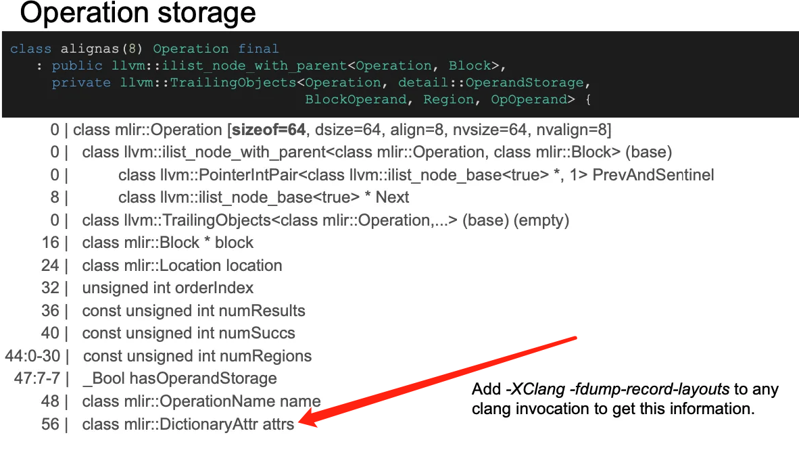

# 🎯 Dive Into MLIR Attributes

> 💡 **本文概述**：深入分析 MLIR Attributes 的内部实现机制，包括属性类型、存储结构、创建过程和性能优化策略。通过本文学习，你将掌握 MLIR 属性系统的核心原理和最佳实践。

---

## 1. MLIR Attribute 介绍

**💡 核心概念：** 直观上我们认为一个 Operation 可以有很多属性，这些属性可以是 td 定义里面预设的，也可以是优化过程中临时添加的。但是实际上，一个 Operation 只含有一个**列表属性**，真正的属性值是存储进属性列表里面而不是Operation里面



**🔍 属性分类：** 其它的属性大致会被分为两种类型，一种是**固有属性**，一种是**可丢弃属性**。


### 固有属性 (Inherent Attributes)

核心概念： 固有属性是操作"天生"就需要的属性，这些属性定义了操作的基本行为和特征。

具体特征：  
- 命名规则：属性名**没有**方言前缀（如：`predicate`、`value`、`type`）  
- 验证责任：操作自己负责检查这些属性是否正确和完整  
- 生命周期：与操作的生命周期绑定，不可随意丢弃  
- 语义要求：必须存在，否则操作无法正确执行  


### 可丢弃属性 (Discardable Attributes)

**核心概念：** 可丢弃属性是操作"额外"的、可以不要的属性，这些属性提供了额外的元数据或配置信息，但不影响操作的核心功能。

具体特征：  
- 命名规则：属性名**必须有**方言前缀（如：`gpu.container_module`、`llvm.linkage`）  
- 验证责任：方言负责检查这些属性是否正确和有效  
- 生命周期：可以随时添加或移除，不影响操作的基本语义  
- 语义要求：可选存在，主要用于优化、调试或元数据管理  

---

## **2. 属性创建**

**核心问题：** 当我们创建属性的时候，背后会发生什么？MLIR 的属性创建过程涉及多个层次的抽象和优化，理解这个过程对于性能调优至关重要。

**基本创建示例：**
```cpp
SmallVector<int64_t> offsetsVec = {1, 2, 3, 4};
auto offsets = DenseI64ArrayAttr::get(getContext(), offsetsVec);
```

### 🔍 2.1 Attribute 结构解析

下面是 Attribute 的内存结构：  

```cpp
class Attribute {
public:
  /// 🏗️ Utility class for implementing attributes.
  template <typename ConcreteType, typename BaseType, typename StorageType,
            template <typename T> class... Traits>
  using AttrBase = detail::StorageUserBase<ConcreteType, BaseType, StorageType,
                                           detail::AttributeUniquer, Traits...>;

  using ImplType = AttributeStorage;
protected:
  ImplType *impl{nullptr};
  // ...  
};
```

从 Attribute 类的定义可以看出，它内部仅还有一个 `ImplType` 类型的指针，而实际的 `ImplType` 是一个 Storage 对象，该 storage 继承自 `StorageUniquer::BaseStorage`。

```cpp
/// 🏗️ Base storage class appearing in an attribute. Derived storage classes should
/// only be constructed within the context of the AttributeUniquer.
class alignas(8) AttributeStorage : public StorageUniquer::BaseStorage {
  // ...
  /// 🔍 The abstract descriptor for this attribute.
  const AbstractAttribute *abstractAttribute = nullptr;
};
```

这里举一个例子，`DenseArrayAttrStorage` 继承自上述的 `AttributeStorage`，实际的成员如下所示：


可以看到，Storage 的派生类里面确实明确地记录了 attribute 的类型、数据、大小等内容，另外也包含了一个 `KeyTy`，用于做哈希运算。

**🎯 总结：** Attribute 仅仅是一个针对于 `AttributeStorage` 的轻量级句柄，实际数据存储在 `AttributeStorage` 中，`AttributeStorage` 由 `StorageUniquer` 保证唯一性，多个 Attribute 句柄可以指向同一个 `AttributeStorage`。

由于上述的设计，我们进行属性拷贝的速度其实是很快的，因为仅仅拷贝了一个指针的大小。

### 2.2 Attribute 数据存储位置

> 💡 **MLIR 设计原则：** 所有数据都由 context 集中管理

```cpp
class MLIRContextImpl {
    DenseMap<TypeID, AbstractAttribute*> registeredAttributes;
    // storage for all attributes
    StorageUniquer attributeUniquer;
}
```

通过代码可以看出，`MLIRContext` 实际上存储了所有的 attribute 内容：

-  `registeredAttributes`：表示注册的属性列表
-  `attributeUniquer`：表示实际的属性内容

#### attributeUniquer

-  `parametricUniquer`
    
    该 map 的 key 是一个 `TypeID`，表示每一种类型的 attribute 都有一个对应的 `ParametricStorageUniquer`，例如 `StringAttr`、`IntegerAttr`、`BooleanAttr` 等。
    

```cpp
///  This is the implementation of the StorageUniquer class.
struct StorageUniquerImpl {
  // ...
  ///  Map of TypeIDs to the storage uniquer to use for registered objects.
  DenseMap<TypeID, std::unique_ptr<ParametricStorageUniquer>> parametricUniquers;
}
```

####  ParametricStorageUniquer

```cpp
class ParametricStorageUniquer {
  ///  Simplified view below
  ///  The set containing the allocated storage instances.
  DenseSet<HashedStorage, StorageKeyInfo> instances;
  ///  Allocator to use when constructing derived instances.
  StorageAllocator allocator;
}
```

-  `instances`
    
    `instances` 是一个哈希值和实际存储类的 set 集合，结合上述的 `attributeUniquer`，可以总结出，每一种类型的 Attribute 都有一个 `instances` 集合，根据哈希值区分该 attribute 类型的不同实例。
    
-  `allocator`
    
    分配器，负责内存分配。
    

#### StorageAllocator

本质上就是一个堆内存分配器，但仅仅负责分配，不负责释放。

```cpp
//  Utility allocator to allocate memory for instances of attributes
class StorageAllocator {
  template <typename T>
  ArrayRef<T> copyInto(ArrayRef<T> elements);  // 复制数组元素
  StringRef copyInto(StringRef str);            // 复制字符串
  template <typename T> T *allocate();          // 分配类型化内存
  void *allocate(size_t size, size_t alignment); // 分配原始内存
  bool allocated(const void *ptr);              // 检查是否已分配
private:
  llvm::BumpPtrAllocator allocator;            // 底层分配器
}
```

### 🔄 2.3 整体属性分配过程


**分配流程：** 当调用属性 `get` 方法时，会按照以下流程返回分配的 storage：

1. 获取 TypeID：获取属性对应的 `TypeID`
2. 查找 Uniquer：根据 `TypeID` 获取该类型对应的 `parametricUniquers`
3. 计算哈希值：计算当前 Storage 的 hash，使用 `KeyTy` 计算
    
    
    
4. 查找实例：查找 `parametricUniquers` 的 `instances` 里面是否有已存在的实例  
   -- 有：直接返回已存在的实例  
   -- 无：调用 `allocator` 分配新的 storage，并插入新的 instance，然后返回  

---

## 3. setAttr() 

当调用 `setAttr` 的时候会发生什么？

```cpp
void setAttr(StringAttr name, Attribute value);
```

**🔄 执行流程：**

1. 创建名称属性：首先会创建一个 `StringAttr name` 类型的属性（注意名字也是属性！）
2. 创建值属性：然后会创建一个 `Attribute value` 类型的属性
3. 替换 DictionaryAttr：由于 Operation 仅含有一个属性列表（也是一个属性），所以每次更新属性后都需要创建一个新的属性列表然后将原来的列表替换
    
    
    

**性能警告：** 所以，`setAttr()` 这个接口的性能其实**非常糟糕**！

**性能问题分析：**  
- **哈希计算开销**：每次调用都需要计算新属性的哈希值  
- **内存分配压力**：频繁分配新的 DictionaryAttr 对象  
- **内存泄漏风险**：旧的属性列表可能无法及时释放  
- **缓存失效**：频繁的内存分配导致缓存命中率下降  

当需要批量创建属性的时候，一个更好的实践是使用 `getAttrDictionary()` 和 `setAttrDictionary()` 两个接口，这样就不会频繁地去替换 `dictionaryAttr` 了。

**批量操作示例：**
```cpp
// 低效方式：逐个设置属性
op.setAttr("attr1", value1);
op.setAttr("attr2", value2);
op.setAttr("attr3", value3);

// 高效方式：批量设置属性
auto dict = op.getAttrDictionary();
dict = dict.set("attr1", value1);
dict = dict.set("attr2", value2);
dict = dict.set("attr3", value3);
op.setAttrDictionary(dict);
```

---

## 4. 实践感悟与思考
> 属性带来的一个最大的工程问题是内存问题，属性创建后会常驻在Context里面，除非你将Context销毁了在重新建一个，要不然这些内存一直不会释放

**实际应用场景：** 在进行编译器开发过程中，尤其是针对于大模型的编译，往往这些模型有很大的常量数据，这些数据一般是通过 `DenseElementAttr` 嵌入到 `ConstantOp` 里面，而编译器一般都会进行大量的常量优化工作，这种情况对于系统的性能和内存压力往往非常巨大。

**具体例子：** 举个例子，我现在有一个 1G 的常量需要做转置，当我将这个 IR Load 进程序中会先消耗掉 1G 的内存去存储常量，然后我进行了 `const + transpose` 的融合操作，现在的内存使用量就变成了 1 + 1 = 2G，如果有大量的常量需要处理并且有大量的常量优化 pass，那这种内存使用几乎就是成倍数增长的。

**内存压力分析：**  
- **常量存储**：大模型中的权重和偏置数据  
- **优化过程**：常量折叠、常量传播等优化 pass  
- **中间结果**：优化过程中产生的临时常量  
- **累积效应**：多个优化 pass 串联时的内存累积  


**实际工程经验：**
采用DenseResourceElementAttr

---
