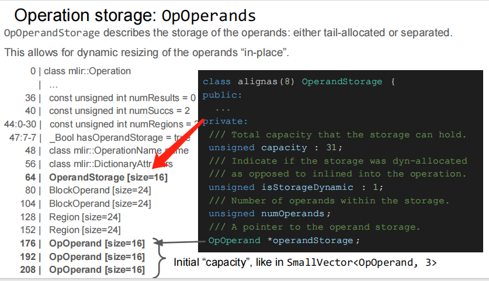
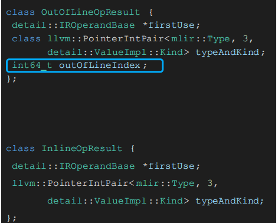
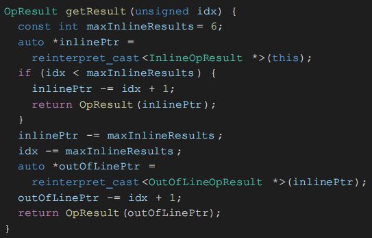

# 🚀 Dive Into MLIR Operation

> 💡 **本文概述**：本文总结了网上可搜到的 MLIR 相关资料，深入分析了 MLIR Operation 的内在实现原理（包含部分代码结构）。阅读完本文后，你将掌握：
> 
> 1. 🔍 **Operation 在内存中的展现形式**  
> 2. 🔗 **Operation 的各个组件与 Operation 之间的联系**  
> 3. ⚙️ **深入了解 Operation 各个接口的实现原理**  

---

## 📖 1. 前言

在深入了解 Operation 的内在实现之前，先介绍一下 Operation 的整体结构：

在 MLIR 中，每一个 **Operation（操作）** 是构建中间表示（IR）的核心单元。每个 Operation 通常具备一套明确的语法结构，其组成部分如下：

### 🔢 **结果值名称和数量（Result Names & Count）**
Operation 通常会产生一个或多个结果值。例如：`%res:2` 表示该操作返回两个结果，并将其命名为 `res`。

### 🏷️ **方言前缀（Dialect Prefix）**
每个 Operation 都隶属于某个特定的方言（Dialect），例如 `mydialect.morph` 表明这是 `mydialect` 方言中的 `morph` 操作。

### 📥 **输入参数（Operands）**
操作的输入使用括号 `()` 括起来，支持指定具体的输入值和索引（如 `%input#3` 表示引用 `%input` 的第 4 个结果）。

### ⚙️ **属性（Attributes）**
花括号 `{}` 中定义了一系列命名的常量属性，例如 `some.attribute = true` 和 `other_attribute = 1.5`，用于静态配置操作行为。

### 📝 **类型签名（Type Signature）**
使用冒号 `:` 来声明操作的输入输出类型，类型可为标准类型或方言自定义类型（如 `!mydialect<custom_type>`）。

### 📍 **位置信息（Location）**
使用 `loc(...)` 明确指出该操作在源码中的位置（例如 `callsite("foo" at "mysource.cc":10:8)`），方便调试和优化。

### 🌐 **区域（Regions）**
Operation 可以包含一个或多个区域（regions），区域中可以嵌套其他操作，支持构建复杂的控制流结构。
    

---

## 🏗️ 2. Operation Implementation

### 📋 2.1 Class 定义

#### 🔗 2.1.1 ilist_node_with_parent

> ilist_node_with_parent 是 LLVM 提供的一个模板类，用于实现**双向链表节点**

将链表指针嵌入到Operation对象中，避免额外的内存分配，可以更好的利用缓存局部性，并提高内存效率

**支持以下功能：**
- 🔄 **前向、后向遍历**  
- ⚡ **高效的插入、删除、移动操作**

#### 🧩 2.1.2 llvm::TrailingObjects

> TrailingObjects 是 LLVM 提供的一个模板类，用于实现**尾部对象模式**（Trailing Objects Pattern），允许在对象末尾存储可变大小的数据
> 

传统设计里面，指针作为函数成员，需要额外的内存分配，访问成员需要进行指针跳转，不利于缓存命中

```cpp
// ❌ 传统设计的问题
class Operation {
    std::vector<Operand> operands;      // 需要额外的内存分配
    std::vector<Region> regions;         // 需要额外的内存分配
    std::map<StringRef, Attribute> attrs; // 需要额外的内存分配
    
    // 🚨 主要问题：
    // 1. 多次内存分配，产生碎片
    // 2. 指针跳转，缓存不友好
    // 3. 内存开销大
};
```

TrailingObjects的解决方案是在进行Operation类分配的时候，默认为该类分配出更多的内存，成员依照TrailingObjects的模版列表依次放在内存中，这样就可以通过指针偏移访问函数成员了，并且可以实现类似于dynamic member的功能，即动态分配内存大小

```cpp
// ✅ 使用 TrailingObjects 的设计
class Operation : private TrailingObjects<Operation, 
                                        OperandStorage,
                                        OpProperties, 
                                        Region, 
                                        OpOperand> {
    // 🎯 优势：
    // 1. 所有数据在内存中连续存储
    // 2. 一次分配获得所有内存
    // 3. 直接访问，无需指针跳转
};
```

```cpp
// 🚀 分配逻辑实现
class Operation {
private:
    // 📏 计算总大小, 继承自TrailingObjects
    static size_t totalSizeToAlloc(unsigned numOperands,
                                   unsigned numRegions,
                                   unsigned numProperties) {
        return sizeof(Operation) +                    // 基础对象大小
               sizeof(OperandStorage) * numOperands + // 操作数存储
               sizeof(OpProperties) * numProperties +  // 属性存储
               sizeof(Region) * numRegions +          // 区域存储
               sizeof(OpOperand) * numOperands;       // 操作数引用
    }
    
public:
    // 🏗️ 创建操作，根据计算得到的size分配足够的内存
    static Operation *create(unsigned numOperands,
                           unsigned numRegions,
                           unsigned numProperties) {
        size_t size = totalSizeToAlloc(numOperands, numRegions, numProperties);
        void *memory = malloc(size);
        return new(memory) Operation(numOperands, numRegions, numProperties);
    }
};
```

### 💾 2.2 Operation Storage

- **0-7   字节**: ilist_node_with_parent类的PrevAndSentinel指针  
- **8-15  字节**: ilist_node_with_parent类的Next指针  
- **16-23 字节**: Block\* block - 指向所属Block的指针  
- **24-31 字节**: Location location - 操作的位置信息  
- **32-35 字节**: unsigned int orderIndex - 操作在Block中的顺序索引  
- **36-39 字节**: const unsigned int numResults - 操作结果数量  
- **40-43 字节**: const unsigned int numSuccs - 后继块数量  
- **44-46 字节**: const unsigned int numRegions - 区域数量 (位域，占用23位)  
- **47    字节**: bool hasOperandStorage - 是否有操作数存储 (位域，占用1位)  
- **48-55 字节**: OperationName name - 操作名称  
- **56-63 字节**: DictionaryAttr attrs - 属性字典  

💡 **动态大小特性：** 当类的成员数量变化时（例如输入数量不同、region数量不同等），Operation 类的大小也会随之变化。下面展示了两个具体例子：
  
  
  

### 🔧 2.3 类成员等访问函数实现

#### 🎯 2.3.1 getSuccessor()

这里以 `getSuccessor(1)` 为例（获取第二个 region 的地址）：


**🔍 地址计算步骤：**  
1. **获取基础地址**：首先拿到 Operation 自己的地址，即 `this` 指针地址  
2. **跳过固定结构**：偏移 64 字节，跳过 Operation 自己的一些固定存储结构  
3. **计算偏移量**：再偏移一个 `OperandStorage` 和两个 `BlockOperand` 的大小  
4. **定位目标**：得到所有 Region 的起始地址，最后取第二个 region 即可得到目标地址  

---

### 📦 2.4 OperandStorage



**💡 OperandStorage 概念：** OperandStorage 可以被认为是一个 Operand 的 vector，它具有以下特性：

- **🏗️ 预分配机制**：有一个初始容量 `capacity` 和首地址指针 `operandStorage`
- **🔧 动态扩展**：这个初始的 vector 被预分配到 Operation 内部
- **⚡ 灵活操作**：每个 Operation 创建时都有初始 Operand 容量，可以任意添加、删除 Operand
- **🔄 自动扩容**：当 size 超过 capacity 时，自动分配新的 block 存储更多 operand
- **🛡️ 稳定性**：添加或删除操作不会影响原有的 Operation Object

### 🎯 2.5 Results

**🔍 存储位置差异：** 在上述的内存描述中，我们没有看到 Results 是如何存储的。事实上，Results 的存储和 Operands 的存储有一些重要区别，如下图所示：


**📋 关键特性：**  
- **🚫 非 TrailingObject**：Results 并不是 TrailingObject 的一部分，所以不会参与预分配  
- **📍 前置存储**：Result 的地址实际上分配到 Operation Object 的地址之前  
- **🔒 固定地址**：Operation 的起始地址是 0，第一个 Result 的起始地址是 -16，Result 地址固定不变  
- **🔄 不可修改**：和后面的 Block、Region 等成员一样，如果要修改这些无法改变的成员，只能重新创建 Operation 并替换原有的 Operation  

**🔍 Result 类型分析：** 在上图中还可以发现有两种 Result 类型：`InlineOpResult` 和 `OutlineOpResult`，并且 `OutlineOpResult` 的 size 比 `InlineOpResult` 的 size 更大。那么区别在哪里？



**📊 结构差异：**  
- **🔍 成员差异**：`InlineOpResult` 比 `OutlineOpResult` 少了一个成员 `outOfLineIndex`  
- **🎯 功能作用**：`outOfLineIndex` 成员帮助计算该 Result 到 Operation 指针的偏移，方便快速获取 Operation 指针  

**❓ 关键问题：**   
为什么 `InlineOpResult` 没有这个成员呢？  

```cpp
/// 🏗️ The base class for all derived Value classes. It contains all of the
/// components that are shared across Value classes.
class alignas(8) ValueImpl : public IRObjectWithUseList<OpOperand> {
public:
  /// 🔍 The enumeration represents the various different kinds of values the
  /// internal representation may take. We use all of the bits from Type that we
  /// can to store indices inline.
  enum class Kind {
    /// 📌 The first N kinds are all inline operation results. An inline operation
    /// result means that the kind represents the result number. This removes
    /// the need to store an additional index value. The derived class here is
    /// an `OpResultImpl`.
    InlineOpResult = 0,

    /// 📍 The next kind represents a 'out-of-line' operation result. This is for
    /// results with numbers larger than we can represent inline. The derived
    /// class here is an `OpResultImpl`.
    OutOfLineOpResult = 6,

    /// 🧱 The last kind represents a block argument. The derived class here is an
    /// `BlockArgumentImpl`.
    BlockArgument = 7
  };
```

**🧠 设计原理解析：**  

由于所有相关的 class 都遵循了 8bit 对齐，所以地址的低三位一定是 0（例如 0x1000, 0x2000, 0x3000 等）。`llvm::PointerIntPair` 可以将低三位利用起来，用来表示一个整数。

**📊 具体实现：**  
- **🔢 内联索引**：这里 Kind 的前 6 个种类表示了 6 个不同的下标  
- **📏 最大支持**：所以最多支持 6 个 InlineOpResult  

**💡 设计优势：**  
- **💾 内存节省**：前 6 个 Result 不需要额外的 index 存储  
- **🎯 实用性强**：通常来说一个 Operation 的输出数量是小于 6 个的  
- **⚡ 性能提升**：这种设计既节省内存又提高了访问效率  

#### 🎯 getResult() 方法



**🔍 工作原理：** 当我们调用 `getResult()` 方法时，实际上就是在做指针的偏移计算。

**📊 访问逻辑：**
- **📌 InlineOpResult 访问**：只需要在 Operation 的地址基础上（`this` 指针）偏移 `index` 个 `InlineOpResult` 的大小即可  
- **📍 OutlineOpResult 访问**：需要先偏移 6 个 `InlineOpResult`，再偏移 `index - 6` 个 `OutOfLineResult` 的大小  

---

## 🎯 总结

通过本文的学习，我们深入了解了 MLIR Operation 的内部实现机制：

### 🏗️ **核心架构**
- 🔗 **链表结构**：使用 `ilist_node_with_parent` 实现高效的双向链表
- 🧩 **内存优化**：通过 `TrailingObjects` 模式实现连续内存布局
- 💾 **动态存储**：支持可变大小的操作数、区域和属性

### 📦 **存储机制**
- **OperandStorage**：预分配的 vector 结构，支持动态扩容
- **Results 存储**：前置存储，固定地址，不可修改
- **类型优化**：InlineOpResult 和 OutlineOpResult 的智能设计

### ⚡ **性能特性**
- **内存节省**：利用地址对齐特性，内联存储索引信息
- **访问优化**：通过指针偏移计算，快速定位目标数据
- **缓存友好**：连续内存布局，提高缓存命中率

这些设计使得 MLIR Operation 既保持了灵活性，又具备了高性能的内存访问特性，是现代编译器基础设施的优秀设计典范。