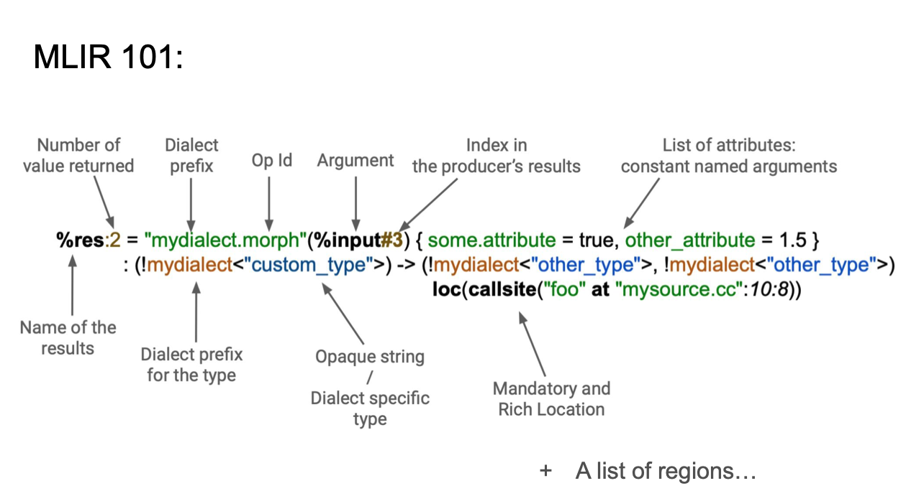
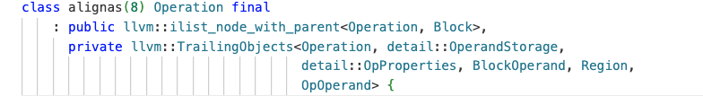
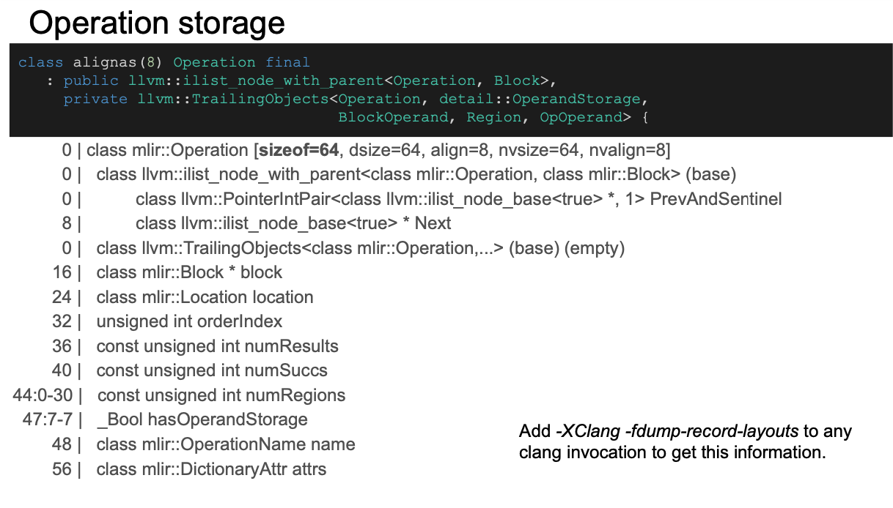
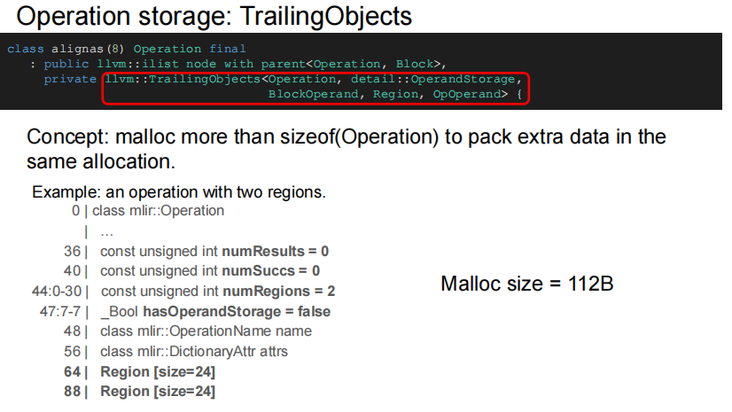
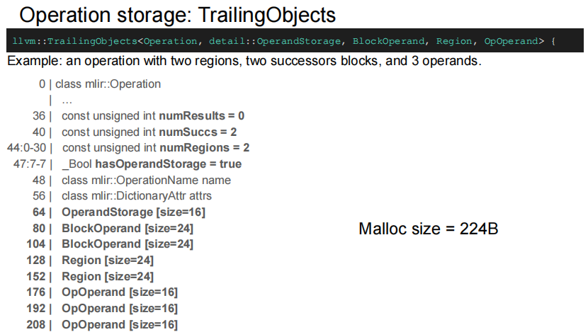
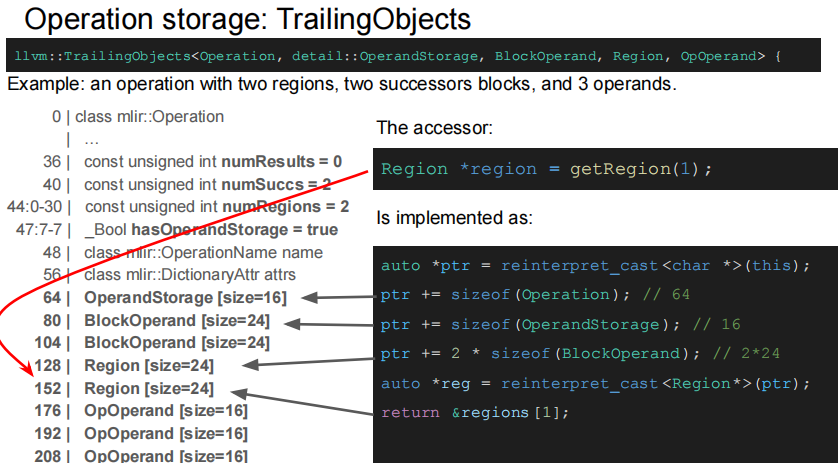

# **MLIR Operation Implementation**

> 本文是总结了一些网上可以搜到的mlir相关资料，总结了mlir Operation的内在实现原理（包含部分代码结构），在阅读完本文后，你可以知道：
1. Operation在内存中的展现形式
2. Operation的各个组件与Operation之间的联系
3. 深入了解Operation各个接口的实现原理
> 

# 1. 前言
在深入了解Operation的内在实现之前，先介绍一下Operation的结构

在 MLIR 中，每一个 Operation（操作）是构建中间表示（IR）的核心单元。每个 Operation 通常具备一套明确的语法结构，其组成部分如下：

1. **结果值名称和数量（Result Names & Count）**
    
    Operation 通常会产生一个或多个结果值。例如：`%res:2` 表示该操作返回两个结果，并将其命名为 `res`。
    
2. **方言前缀（Dialect Prefix）**
    
    每个 Operation 都隶属于某个特定的方言（Dialect），例如 `mydialect.morph` 表明这是 `mydialect` 方言中的 `morph` 操作。
    
3. **输入参数（Operands）**
    
    操作的输入使用括号 `()` 括起来，支持指定具体的输入值和索引（如 `%input#3` 表示引用 `%input` 的第 4 个结果）。
    
4. **属性（Attributes）**
    
    花括号 `{}` 中定义了一系列命名的常量属性，例如 `some.attribute = true` 和 `other_attribute = 1.5`，用于静态配置操作行为。
    
5. **类型签名（Type Signature）**
    
    使用冒号 `:` 来声明操作的输入输出类型，类型可为标准类型或方言自定义类型（如 `!mydialect<custom_type>`）。
    
6. **位置信息（Location）**
    
    使用 `loc(...)` 明确指出该操作在源码中的位置（例如 `callsite("foo" at "mysource.cc":10:8)`），方便调试和优化。
    
7. **区域（Regions）**
    
    Operation 可以包含一个或多个区域（regions），区域中可以嵌套其他操作，支持构建复杂的控制流结构。
    

# 2. Operation **Implementation**

## 2.1 Class定义

### 2.1.1 ilist_node_with_parent

> ilist_node_with_parent 是 LLVM 提供的一个模板类，用于实现**双向链表节点**
> 

将链表指针嵌入到Operation对象中，避免额外的内存分配，可以更好的利用缓存局部性，并提高内存效率

支持以下功能：

- 前向、后向遍历
- 高效的插入、删除、移动操作

### 2.1.2 llvm::TrailingObjects

> TrailingObjects 是 LLVM 提供的一个模板类，用于实现**尾部对象模式**（Trailing Objects Pattern），允许在对象末尾存储可变大小的数据
> 

传统设计里面，指针作为函数成员，需要额外的内存分配，访问成员需要进行指针跳转，不利于缓存命中

```cpp
// 传统设计的问题
class Operation {
    std::vector<Operand> operands;      // 需要额外的内存分配
    std::vector<Region> regions;         // 需要额外的内存分配
    std::map<StringRef, Attribute> attrs; // 需要额外的内存分配
    
    // 问题：
    // 1. 多次内存分配，产生碎片
    // 2. 指针跳转，缓存不友好
    // 3. 内存开销大
};
```

TrailingObjects的解决方案是在进行Operation类分配的时候，默认为该类分配出更多的内存，成员依照TrailingObjects的模版列表依次放在内存中，这样就可以通过指针偏移访问函数成员了，并且可以实现类似于dynamic member的功能，即动态分配内存大小

```cpp
// 使用 TrailingObjects 的设计
class Operation : private TrailingObjects<Operation, 
                                        OperandStorage,
                                        OpProperties, 
                                        Region, 
                                        OpOperand> {
    // 所有数据在内存中连续存储
    // 一次分配获得所有内存
    // 直接访问，无需指针跳转
};

// 分配逻辑如下
class Operation {
private:
    // 计算总大小, 继承自TrailingObjects
    static size_t totalSizeToAlloc(unsigned numOperands,
                                   unsigned numRegions,
                                   unsigned numProperties) {
        return sizeof(Operation) +                    // 基础对象大小
               sizeof(OperandStorage) * numOperands + // 操作数存储
               sizeof(OpProperties) * numProperties +  // 属性存储
               sizeof(Region) * numRegions +          // 区域存储
               sizeof(OpOperand) * numOperands;       // 操作数引用
    }
    
public:
    // 创建操作，根据计算得到的size分配足够的内存
    static Operation *create(unsigned numOperands,
                           unsigned numRegions,
                           unsigned numProperties) {
        size_t size = totalSizeToAlloc(numOperands, numRegions, numProperties);
        void *memory = malloc(size);
        return new(memory) Operation(numOperands, numRegions, numProperties);
    }
};
```

## 2.2 Operation Storage

- **0-7 字节**: ilist_node_with_parent类的PrevAndSentinel指针
- **8-15 字节**: ilist_node_with_parent类的Next指针
- **16-23 字节**: Block* block - 指向所属Block的指针
- **24-31 字节**: Location location - 操作的位置信息
- **32-35 字节**: unsigned int orderIndex - 操作在Block中的顺序索引
- **36-39 字节**: const unsigned int numResults - 操作结果数量
- **40-43 字节**: const unsigned int numSuccs - 后继块数量
- **44-46 字节**: const unsigned int numRegions - 区域数量 (位域，占用23位)
- **47 字节**: bool hasOperandStorage - 是否有操作数存储 (位域，占用1位)
- **48-55 字节**: OperationName name - 操作名称
- **56-63 字节**: DictionaryAttr attrs - 属性字典

当类的成员数量变化的时候，例如输入数量不同、region数量不同等，Operation类的大小也会随之变化， 例如下面这两个例子:



## 2.3 类成员等访问函数实现

### 2.3.1 getSuccessor()

这里拿getSuccessor(1)举例（获取第二个region的地址）

首先需要拿到Operation自己的地址，即this指针地址，然后偏移64表示跳过Operation自己的一些固定存储结构，然后在偏移一个OperandStorage和两个BlockOperand的大小即可得到所有Region的起始地址，最后在取第二个region即可得到想要的地址